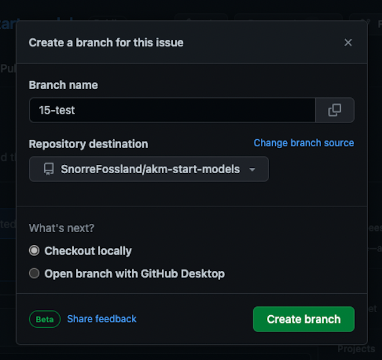
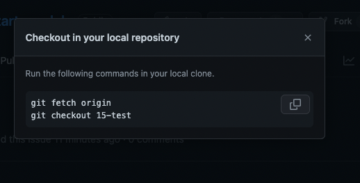

#### 2.2.1. Prepare a branch to upload the project file too

Go to the GitHub repository and into the model folder <code> Open Github.com </code> 

To keep track of the changes we will use GitHub's versioning system.

Go to the GitHub repository in the web browser (<https://github.com/UserName/RepositoryName>)

Navigate to the model folder (StartModels, Models etc. by opening the folder).

Open the Issues <code> Click "Issues" in the menu</code>

This will be used to keep track of the changes.

Create a new issue in the GitHub repository by clicking on Issues in the menu.

Create a "New Issue" <code> Click "New Issue" button</code>

Click on the "New Issue" button.

---

Name and submit the Issue ...  <code> Type in Name (and description) </code>

Type a name and description for the issue in the "Title" and "Description" field.

then click on the "Submit New Issue" button.

---

Go to Create branch <code> Click "Create a branch" link (lower right in the page)</code>

---

Create the new branch  <code> Click "Create branch" button</code>

Click on the "Create branch" button.

---

Checkout the branch  <code> (only if local repository)</code> (this step can be skipped)

(If you want to clone to a local repository you can copy these two lines and execute them in your terminal.)

---

---

In the following we will use the upload file function to upload the model project file to the GitHub repository,  
(so the local clone is not necessary and the copying of the two lines can be dropped.)
