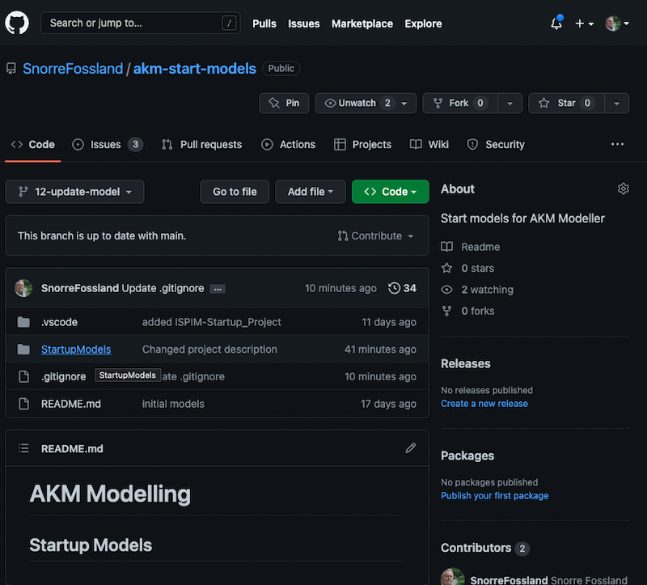
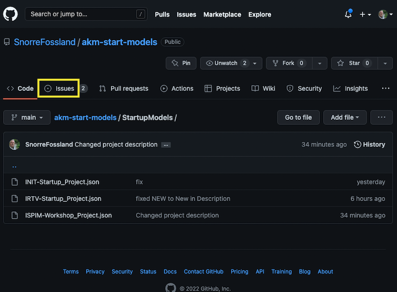
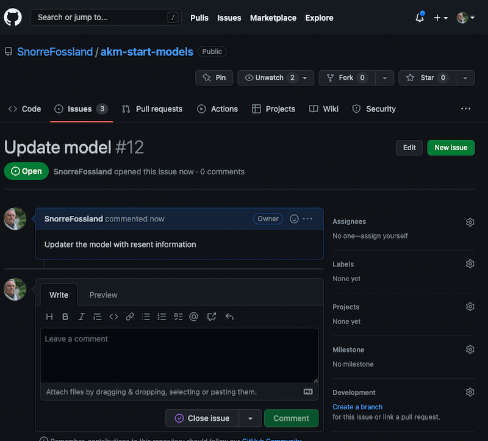
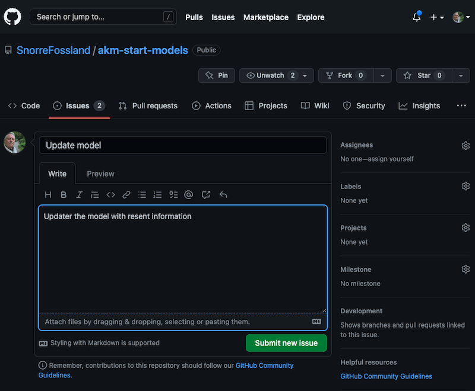
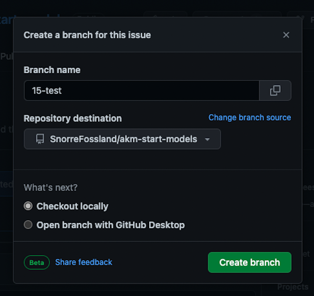
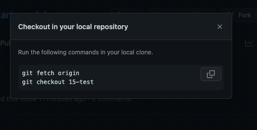
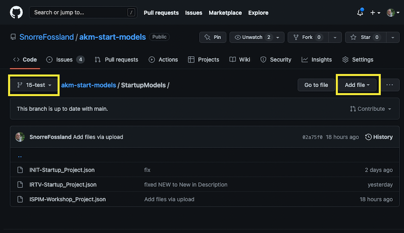

# AKM Modelling

## Introduction

AKM Modelling can be done as a individual task with models stored in local Project.json files.
It can also be done as a collaborate task with several team members.

Project.json files can be saved

- locally on your computer (PC) and loaded in the AKM Modeller when needed.
- globally in a GitHub repository and loaded in the AKM Modeller when needed.

## Lets get started

Start AKM Modeller by selecting "Modelling" in the top menu.

---

### 1. Use Local Project files

To open local project files: <code> Click: "Choose file" button</code>

Click on: Project files: "Choose file" button and select the project file you want to load (.json file).

The selected file will be loaded in the AKM Modeller.

---

To save local project files: <code> Click on: "Save" button</code>

To save the current project.json file Click on the "Save" button. 

The file will default be saved in Download folder as the "Projectname"_project_"date".json file.

---

### 2. Use GitHub Project files

#### 2.1. To open GitHub project files:

To open GitHub repository AKM project files: <code> Click on: "GitHub" button</code>

Click on "GitHub" button to open the dialog for GitHub repository and fill in the required fields.

- Repository URL:  https://api.github.com/users/UserName/repos/
- Repository name: RepositoryName
- Branch name:     Main (default and cannot be changed)
- Model path:      Path/To/Model/Folder

then click on: "LIST MODELS" button and then select a model in the "Select Model" dropdown list.

The model will be loaded in AKM Modeller.

Click on "X" button in the top right corner to close the GitHub repository select dialog.

---

---

#### 2.2. To save GitHub project files

##### 2.2.1. Prepare a branch to upload the project file too:

Go to the GitHub repository and into the model folder <code> Open Github.com </code>

To keep track of the changes we will use GitHub's versioning system.

Go to the GitHub repository in the web browser (https://github.com/UserName/RepositoryName)

Navigate to the model folder (StartModels, Models etc. by opening the folder).

Open the Issues by clicking on "Issues" in the menu ...  <code> </code>

This will be used to keep track of the changes.

Create a new issue in the GitHub repository by clicking on Issues in the menu.

Then click on the "New Issue" button ...  <code> </code>

Click on the "New Issue" button.

---

Name and submit the Issue ...  <code> </code>

Type a name and description for the issue in the "Title" and "Description" field. 

then click on the "Submit New Issue" button.

---

Go to Create branch by clicking on the "Create a branch" link in the lower right of the page ...  <code> </code>

---

Create the new branch  <code> </code>

Click on the "Create branch" button.

---

Checkout the branch (this step can be skipped if you are not using local repository  <code> </code>

(If you want to clone to a local repository you can copy these two lines and execute them in your terminal.)

---

---

In the following we will use the upload file function to upload the model files to the GitHub repository, so the local clone is not necessary and the copying of the two lines can be dropped.

##### 2.2.2. Upload the project file:

Go to the GitHub repository and into the model folder (the same as in 2.2.1) and select the branch you created the last step in 2.2.1   <code> </code>

Select the branch you created the last step in 2.2.1.

Navigate to the model folder (StartModels, Models etc. by opening the folder).

Drag in the updated project.json file (the updated model) and click "Commit changes  <code> </code>

Drag in file and click "Commit changes" button.

Compare and Pull request  <code> </code>

Click "Compare & pull request" button.

Create Pull Request for the uploaded model project file <code> </code>

As you see this will create a pull request for the uploaded model project file from your branch to the main branch.

(Add a comment and)Click "Create pull request" button.

Confirm Merge <code> Click "Create pull request" button</code>

As you see this will create a pull request for the uploaded model project file from your branch to the main branch.

(Add a comment and)Click "Create pull request" button.

The update of the project file to the main branch is completed <code> "Sucessfully Merged!" </code> 

The Main branch is updated with the new model project file

Delete you temporary branch <code> Click: "Delete branch" button</code>

Your branch which was created for the upload of the model project file can be deleted.

